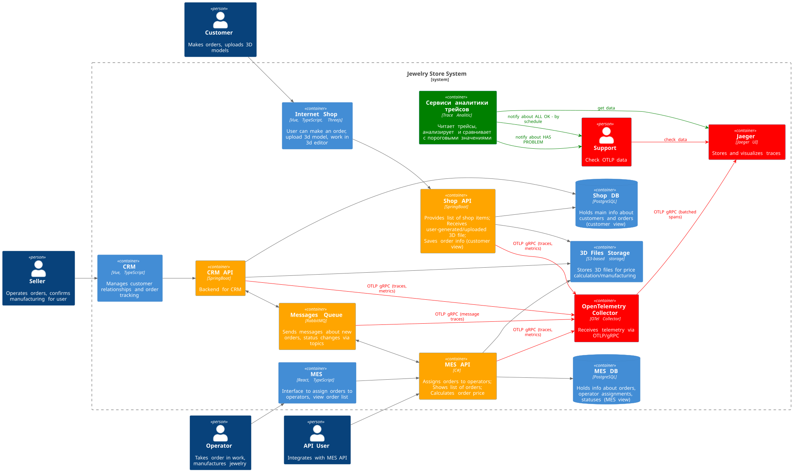
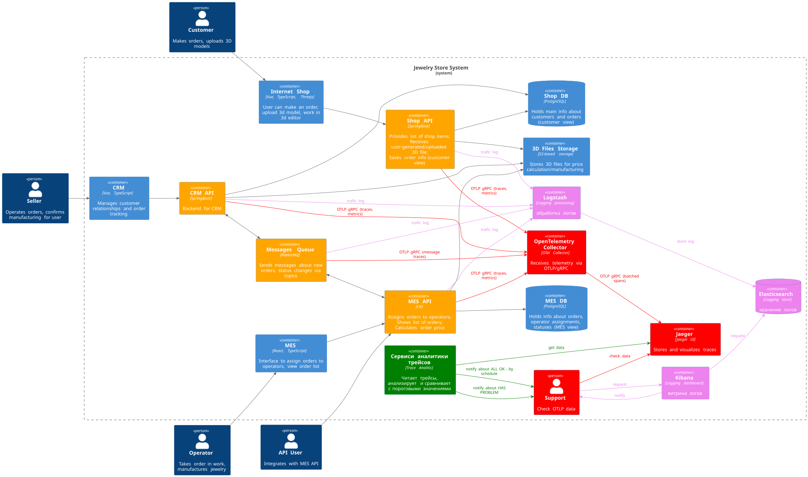

# Архитектурное решение по логированию

## 1. Планирование логирования

| Компонент | Критические логи (уровень INFO)                                                                                                          | Другие уровни                                                                                              |
| ------------------ | -------------------------------------------------------------------------------------------------------------------------------------------------------------- | ---------------------------------------------------------------------------------------------------------------------- |
| **Shop API** | • Создание заказа:`order_id`, `customer_id`, `timestamp`  • Загрузка 3D-модели: `file_hash `, `validation_result` | `ERROR` — сбои загрузки в S3 `WARN` — повторные запросы от одного IP        |
| **CRM API**  | • Изменение статуса заказа:`order_id`, `old_status` → `new_status`, `user_role` (seller/operator)                              | `ERROR` — ошибки синхронизации со Shop DB                                                      |
| **MES API**  | • Назначение оператора:`order_id`, `operator_id` • Расчёт цены: `model_volume`, `material_type`                    | `ERROR` — ошибки при работе с 3D-файлами `WARN` — долгие расчёты (>5 сек) |
| **RabbitMQ** | • Публикация события:`event_type` (order.created), `queue_name` • Перемещение в DLQ: `message_id`, `reason`        | `ERROR` — недоступность очереди                                                                 |

**Примечания:**

* Все критические логи фиксируются с уровнем **INFO** и обязательны для мониторинга
* Логи `ERROR` и `WARN` требуют оповещения и оперативного реагирования
* Для всех записей рекомендую добавлять `timestamp` и `correlation_id` для трассировки

Системы, требующие сбора логов, отмечены оранжевым цветом

## 2. Мотивация

Текущая модель разбора инцидентов через рассказы клиентов:

* Увеличивает время реакции (до часов/дней),
* Повышает нагрузку на поддержку (50% запросов — повторяющиеся сценарии),
* Снижает доверие клиентов из-за задержек.
* Метрики, на которые повлияет логирование

| Тип метрики              | Пример                                                                                           | Ожидаемый эффект                         |
| ---------------------------------- | ------------------------------------------------------------------------------------------------------ | ------------------------------------------------------- |
| **Бизнес**             | Среднее время решения инцидента (MTTR)                                     | Сокращение с 4 часов до 15 минут |
| **Техническая**   | Доля автоматически обнаруженных ошибок                              | Рост с 10% до 70% за 6 месяцев          |
| **Операционная** | Количество обращений в поддержку по «зависшим» заказам | Снижение на 40% за 3 месяца           |
| **Финансовая**     | Стоимость устранения инцидентов (man-hours)                               | Экономия 200 часов/месяц              |

Приоритетные системы для внедрения

1. Shop API — точка входа заказов, 80% инцидентов начинаются здесь.
2. MES API — критичен для производства, ошибки ведут к финансовым потерям.
3. RabbitMQ — потеря сообщений разрывает сквозной процесс.

Логирование, в дополнение к трейсингу, может помочь:

* Воспроизвести проблемные ситуации - благодаря сохранению хронологии событий;
* Оптимизировать бизнес-процессы - анализируя реальные временные затраты на каждом этапе;
* Улучшить взаимодействие между компонентами системы - отслеживая корректность передачи данных между модулями;
* Сформировать доказательную базу - при возникновении спорных ситуаций с клиентами или партнерами;
* Проводить ретроспективный анализ - изучая исторические данные для выявления скрытых проблем.

## 3. Предлагаемое решение

Перед началом внедрения логирования - выработать единый формат лога - упростить дальнейший анализ.
Во время его выработки - проанализировать, что можно писать в него, а что нельзя.
Персональные данные - маскирование или анонимизация, секреты исключаем и т.д.
Оценить предполагаемый трафик логов и на его основе принять решение о сроке жизни горячих и холодных логов (например 7 дней/ 90 дней)
Далее будем развиваться в сторону ELK стека.
На машинах развёртывания запись логов в файловую систему (предусмотрим пакетную запись для уменьшения дисковых операций).
Транспорт логов через FileBeat в центральное хранилище логов.

Настраиваем логирование и трейсинг в первую очередь именно для API и брокера, так как они дадут предположительно до 80% решения поставленной задачи.

### Технологии

* FileBeat - транспорт
* Elasticsearch – хранение и индексация (доступ из закрытого контура)
* Logstash – обработка логов
* Kibana – визуализация и анализ (доступ по ролевой системе из закрытого контура)

### Политика хранения

* Индексы по сервису и окружению: `logs-<env>-<service>-YYYY.MM.DD`
* Ретенция: `prod` — 30 дней для `INFO`/`WARN`, 90 дней для `ERROR`; `dev` / `release` — 14 дней.
* Ротация по размеру (20–40 ГБ/индекс) и времени; `снапшоты` "при инциденте" при необходимости.

Новый вид схемы

## 4. На пути к системе анализа логов

* Настройка алертинга:
  * Зависшие заказы (статус заказа не меняется сверх определённых стандартов)
  * Внезапный рост количества заказов
  * Рост количества 5xx ошибок и 4xx.
  * Рост кол-ва неверных авторизаций и пр.
* Поиск аномалий
  * Аномальный рост количества заказов
  * Долгие операции (сверх установленных нормативов на основе статистики)
  * Некорректный формат загружаемых файлов

## 5. Отбор технологий

Выбор по умолчанию: OpenSearch — отсутствие лицензионных рисков и привычный поиск.

| Критерий                                                                     | ELK                                                              | OpenSearch                                                      | Splunk                                                                       | Loki                                                                          |
| ------------------------------------------------------------------------------------ | ---------------------------------------------------------------- | --------------------------------------------------------------- | ---------------------------------------------------------------------------- | ----------------------------------------------------------------------------- |
| Лицензия                                                                     | Elastic License                                                  | Apache License, Version 2.0                                     | Проприетарная                                                   | AGPLv3                                                                        |
| Полнотекстовый поиск                                         | Полноценный                                           | Полноценный                                          | Полноценный                                                       | Ограниченный (по меткам)                             |
| Стоимость                                                                   | Бесплатно + платные фичи                     | Бесплатно                                              | Высокая (per GB)                                                      | Бесплатно  + Grafana Cloud                                      |
| Работа с агентами транспортировки логов | Filebeat, Logstash (сложная настройка)      | Совместим с агентами ELK + Data Prepper | Универсальный Forwarder  (проприетарный) | Promtail/FluentBit (лёгкие, интеграция  с Grafana) |
| Community                                                                            | Крупное, но коммерциализировано | Активное (форк ELK)                                 | Корпоративное                                                   | Растущее (экосистема Grafana)                          |
| Документация                                                             | Подробная, но фрагментированная | Хорошая, открытая                                | Enterprise- ориентированная                              | Чёткая, но узкоспециализированная          |
