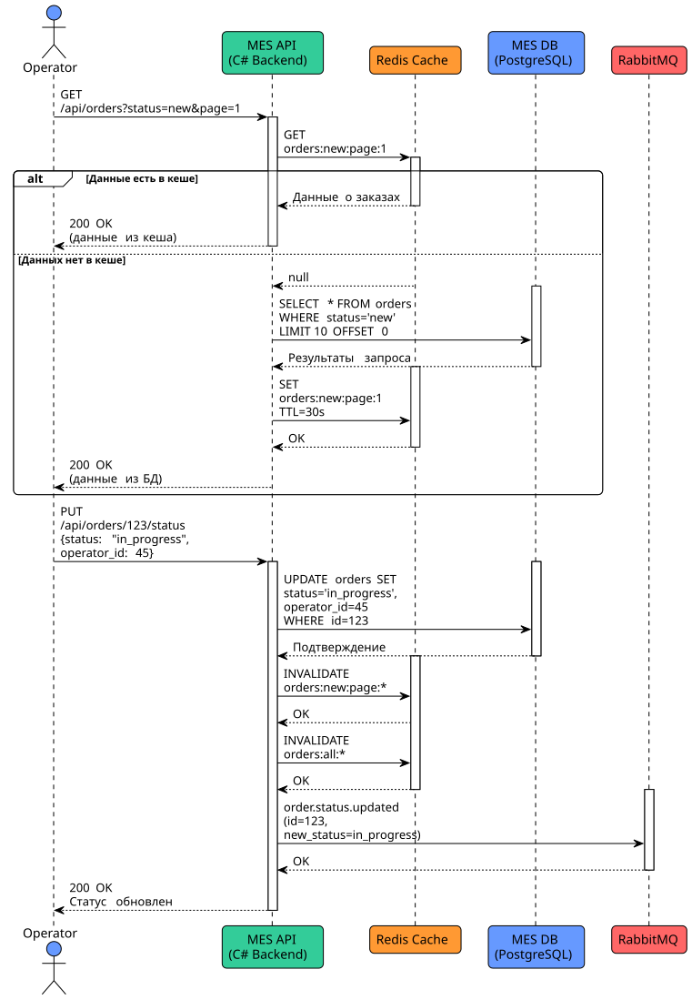

# Архитектурное решение по кешированию

## 0. С чем работаем?

Будем работать с MES API, а именно со страницей со статусами заказов для подрядчиков

## 1. Мотивация

Проблемы, которые решает кеширование:

* Низкая производительность дашборда операторов : первая страница MES загружается слишком долго, что критично для операторов, которым нужно оперативно брать новые заказы для получения вознаграждения.
* Высокая нагрузка на базу данных: частые запросы всех операторов к списку заказов создают избыточную нагрузку на MES DB.
* Плохой пользовательский опыт: даже после внедрения фильтров и пагинации проблема осталась, что указывает на необходимость более глубокого архитектурного решения.

Элементы системы для кеширования:

* Список активных заказов по статусам на дашборде операторов в MES.
* Данные о новых заказах, которые постоянно обновляются и критичны для операторов.

Кеширование этих данных позволит значительно сократить время отклика системы при открытии дашборда и снизить нагрузку на базу данных, особенно в часы пиковой активности операторов (утренние часы, после обеда).

## 2. Предлагаемое решение

Предлагается внедрить серверное кеширование с использованием `Redis`. Клиентское кеширование не решит проблему полностью, так как:

* Каждый оператор будет запрашивать одни и те же данные одновременно (утром при начале работы).
* Снижение нагрузки на серверную часть критично для общей производительности системы.

**Паттерн кеширования**:

Выбран паттерн `Cache-Aside` (Lazy Loading). Этот паттерн наиболее подходит для текущей ситуации по следующим причинам:

| Паттерн          | Преимущества для нашей задачи                                                                                                                                                                                                                                                                                                  | Недостатки для нашей задачи                                                                                                                                                                          |
| :---------------------- | :------------------------------------------------------------------------------------------------------------------------------------------------------------------------------------------------------------------------------------------------------------------------------------------------------------------------------------------------------- | :--------------------------------------------------------------------------------------------------------------------------------------------------------------------------------------------------------------------------- |
| **Cache-Aside**   | • Прост в реализации • Эффективен для часто читаемых, редко изменяемых данных  • Система продолжит работать при сбое кеша  • Минимизирует "холодные" запросы к БД после перезагрузки | • Возможен "кэш-пробой" при одновременном запросе  отсутствующих данных                                                                                |
| **Write-Through** | • Данные всегда актуальны в кеше • Снижает задержку при чтении                                                                                                                                                                                                                                  | • Увеличивает задержку при записи • Неоптимален для нашего случая,  где запись происходит реже чтения                         |
| **Refresh-Ahead** | • Предотвращает задержки при чтении "просроченных" данных                                                                                                                                                                                                                                          | • Сложность реализации • Может кэшировать редко используемые данные  • Избыточная нагрузка на БД при предзагрузке |

## 3. Альтернативные решения

Можно предложить альтернативное решение.

### WebSocket

Например, если исходить, что партнёров не так и много до 1000, то можно предложить уведомлять их об изменениях в статусах и списках заказов на основе WebSocket. Тогда они бы получали долгую первичную загрузку и обновление практически в реалоьном времени. Но тогда придётся донастраивать каналы соединения, что может привести к ошибкам, так как команда уже неплохо работает с обычными WEB API.

### Kafka

Рассмотреть возможность писать изменения по статусам в топики для каждого партнёра.
Тогда каждый партнёр сможет сам отслеживать изменения и читать от своего последнего смещения.
Какие минусы - новый стек, сложности с настройкой доступа.

Исходя из всего вышеизложенного, я бы остановился на работе через Redis, и вернулся к рассмотрению WebSocket/Kafka после устранения текущих проблем.
